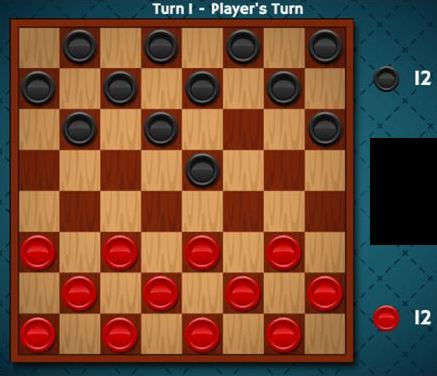
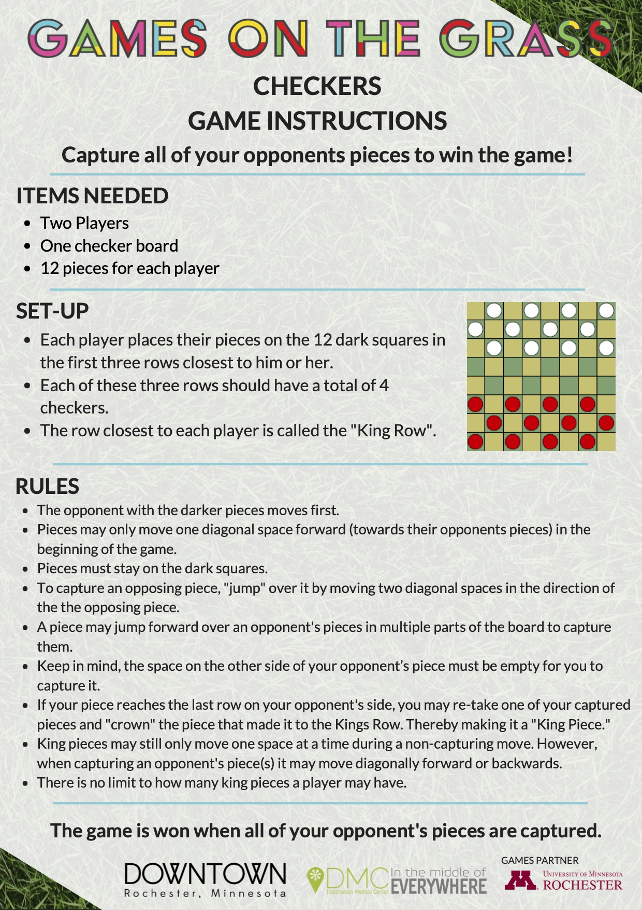

# Project-1
First project for Bootcamp

## Idea Overview
____

A classic recreation of the game Checkers. Two players battle to eliminate as many enemy pieces from the board by "consuming" or "jumping" enemy pieces. The winner is the player with the last piece on the board.

## Tech Stack
____

The game will JavaScript heavy, but to style the page I plan on using Bootstrap or Tailwind CSS.

## MVP
____

[] A functional menu for starting the game

[] Having win conditions

[] Having players "consume" or "jump" enemy pieces

[] Limiting player movements so player cannot go out of bounds of the board, or to a space they shouldn't be allowed to occupy (like moving backwards at the beginning)

[] Allowing players to be "Kinged" to let their pieces go in reverse direction

[] Alternating turns between Player 1 and Player 2

## Stretch Goals
___

[] Allowing multiple jumps with the same piece

[] Resetting the board without reloading the page to allow for multiple plays

[] Tracking player wins

[] Allowing the player to "click and drag" the game pieces

[] Simple AI that moves pieces at random with no strategy

[] Minimax AI that tries to beat the player

## Wire Frames
___

### Basic Rules We Will Follow

## Roadblocks
___

- Dealing with how to traverse the board (only black squares are traversable)
- Limiting player's moves
- "Jumping" enemy pieces
- (Stretch Goals Only) AI movements